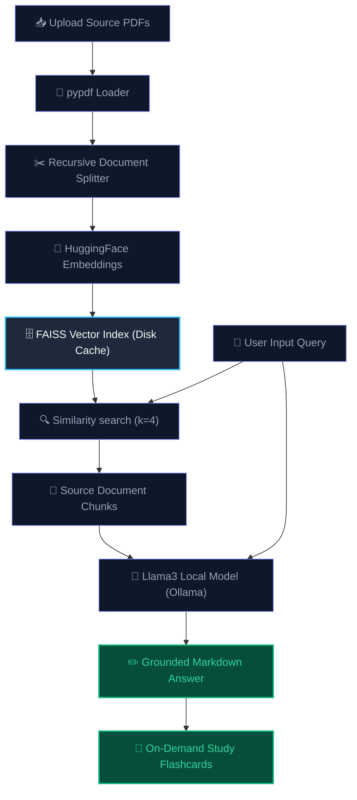

# 📄 DocuMind AI

### *Chat with PDFs. Learn Faster. Your Personal Document Intelligence Assistant.*

DocuMind AI is a professional-grade, high-performance document intelligence platform designed to transform passive reading into active learning. By combining local LLM reasoning with advanced retrieval-augmented generation (RAG), DocuMind AI allows users to chat with multiple PDF documents side-by-side with an integrated page-viewer, see transparent inline page citations, and generate study flashcards on demand.

---

## 👥 Developer & Owner

- **Pratyaksha Gupta**
- **GitHub**: [github.com/pratyakshagupta16](https://github.com/pratyakshagupta16)
- **LinkedIn**: [LinkedIn Profile](https://www.linkedin.com/in/pratyakshagupta16/)

---

## 🚀 Live Demo

🌐 **Live Streamlit App**: [s9dxsrr7do2kemrkdhpwos.streamlit.app](https://s9dxsrr7do2kemrkdhpwos.streamlit.app/)  
🐳 **Docker Container Image**: [Docker Hub Link](https://hub.docker.com/r/pratyakshagupta16/documind-ai)

---

## 📖 Project Overview & Value Proposition

Traditional document analysis often involves manual skimming, searching through hundreds of pages, and copy-pasting notes—a passive process with high cognitive load. **DocuMind AI** bridges this gap by acting as a responsive study workspace. 

By utilizing local embedding models and FAISS vector databases, the application indexes your PDFs in seconds. Users can ask questions in natural language and receive grounded, structured responses instantly, coupled with an interactive split-screen layout to cross-reference answers with the exact source pages.

---

## 🛠️ System Architecture



---

## ✨ Key Features

- **💬 Multi-PDF Document Chat**: Query single or multiple documents concurrently. Answers are strictly grounded in document text.
- **📖 Integrated PDF Viewer**: A split-screen document viewer displays selected files. Jump to the exact source page dynamically by clicking inline citation references.
- **🔍 Transparent Inline Citations**: Source references are presented directly under the response, with expandable context boxes highlighting the extracted source snippets.
- **📇 On-Demand Study Flashcards**: Turn any answer into structured questions and answers with collapsible cards to test your retention.
- **📥 Notes Export**: Download complete study notes, summaries, page citations, and study flashcards as a structured Markdown file.
- **⚡ Performance Cache**: PDF loading and index vectorization are cached via Streamlit resources, running exactly once per distinct file upload set.
- **🛡️ Local Ollama Inference**: Private, local model queries using your own workstation CPU/GPU compute, securing your document privacy.

---

## 💻 Tech Stack

- **Frontend & UI Layout**: Streamlit (Vanilla CSS customization, glassmorphic dark-theme, responsive dual columns)
- **RAG & Chunking Orchestration**: LangChain Core (`langchain-core`), LangChain Community (`langchain-community`)
- **LLM Engine**: `langchain-ollama` (defaulting to `llama3`)
- **Embeddings**: `langchain-huggingface` (running `sentence-transformers/all-MiniLM-L6-v2`)
- **Vector Database**: FAISS (`faiss-cpu`)
- **PDF Extraction**: `pypdf`

---

## 📷 Screenshots / Demo


---

## ⚙️ Installation & Setup

### Prerequisites
- Python 3.10+
- [Ollama](https://ollama.com/) installed and running on your system

### 1. Local Application Setup
```bash
# Clone the repository
git clone https://github.com/pratyakshagupta16/DocuMind-AI.git
cd DocuMind-AI

# Create and activate virtual environment
python -m venv venv
# Windows:
.\venv\Scripts\activate
# MacOS/Linux:
source venv/bin/activate

# Install dependencies
pip install -r requirements.txt
```

### 2. Configure Local Ollama Engine
Ensure Ollama is running, then pull the target model (default `llama3`):
```bash
ollama pull llama3
```

### 3. Environment Variables
Create a `.env` file in the root workspace directory:
```env
OLLAMA_MODEL=llama3
OLLAMA_BASE_URL=http://localhost:11434
```

### 4. Running the Project
```bash
streamlit run frontend/app.py
```

---

## 💡 Use Cases

- **🎓 Academic Study**: Quickly summarize scientific papers, draft flashcards for exam preparation, and trace citations directly.
- **💼 Legal & Professional Audits**: Search contracts, document indexes, or reference manuals for specific terms and navigate directly to target sections.
- **📝 Development & Research Documentation**: Query system architectures, textbooks, or package guidelines in bulk.

---
